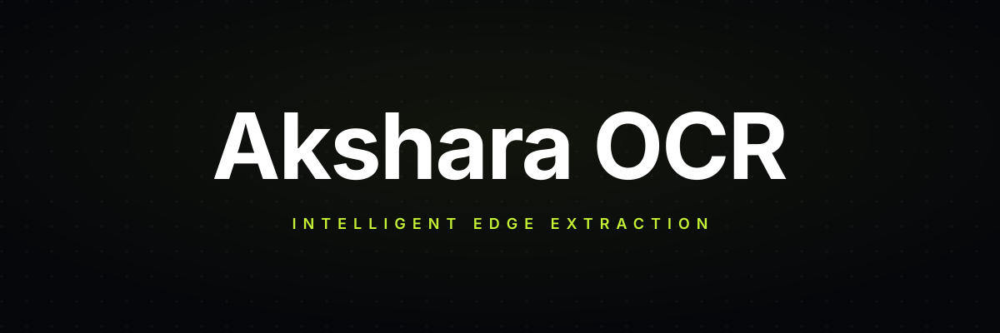
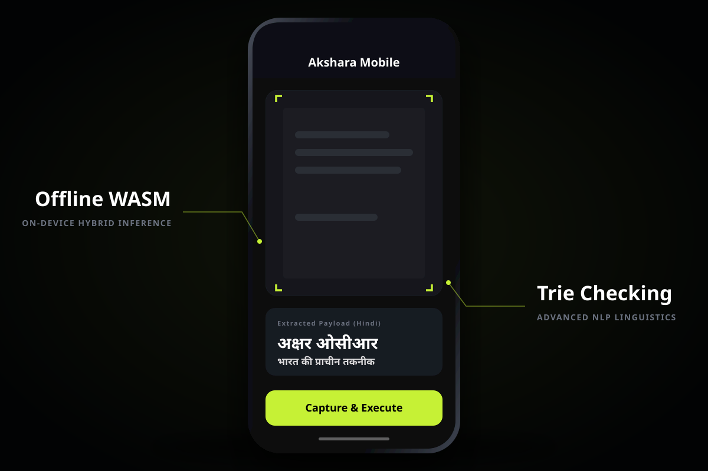
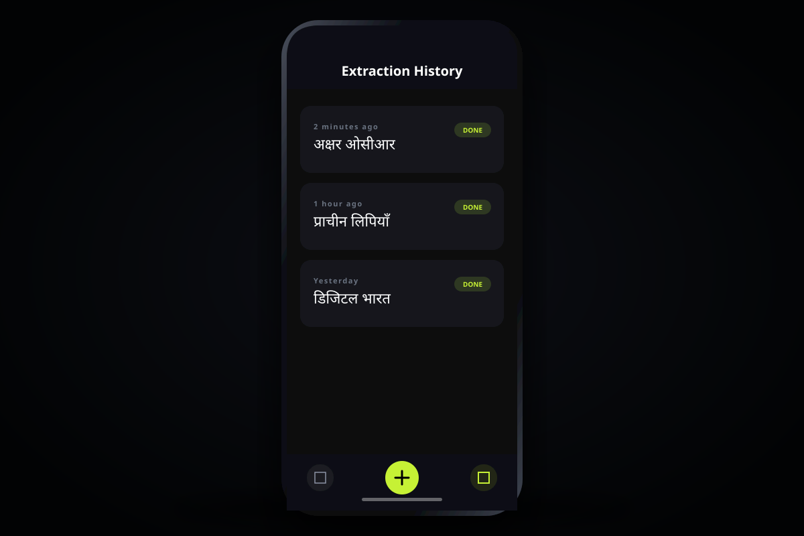

<div align="center">
  
</div>

# Akshara OCR

Akshara OCR is a high-performance, **native-first** Optical Character Recognition platform designed specifically for Devanagari (Hindi) script. All inference runs entirely on-device — no server round-trips, no telemetry, no uploads.

> [!IMPORTANT]
> **v9 is the final build of this project for this phase.** CRNNv9 (STN + MobileNet + 6-layer Transformer encoder + EMA + label smoothing) is trained on the merged combined + auto-labeled corpus (233K train rows), exported to ONNX, and deployed as the production model the frontend loads. Production checkpoint: `model/checkpoints_v9/run_v9_20260420_011555/best_v9.pth`. Benchmarks: **CER 10.90% / WER 31.62%** on the new `verified_test_labels.txt` (1,164 rows), **CER 2.24% / WER 6.79%** on the in-domain auto-labeled held-out val. Deferred next-phase work (KenLM language-model beam rescoring, encoder-decoder architecture, conjunct BPE tokenizer) is documented in [docs/v9-design.md](docs/v9-design.md) but not part of this shipped build.

## Key Features

1. **Hardware-Accelerated Inference** — `onnxruntime-web` with WebGPU runs the exported CRNN model directly in the browser.
2. **Line Segmentation** — Vertical Projection Profiling with robust morphology for multi-line documents.
3. **100% Privacy** — No images or extracted text ever leave the device. Local history stored in `localStorage`.
4. **Offline First** — PWA-ready; Capacitor wrapper ships for Android.
5. **Honest Benchmarking** — Text-disjoint train/val split guarantees metrics measure generalization, not memorization.

## Model generations

CER measured across three benchmarks (lower is better). Full grid with WER, exact-match, and empty-prediction rate is in [`docs/benchmark-matrix.md`](docs/benchmark-matrix.md) (regenerate with `./venv/bin/python -m scripts.devtool.benchmark_matrix`).

| Version | Architecture | combined_val | verified_test | auto_labeled_heldout_val |
|---|---|---:|---:|---:|
| v1 | CRNN (block + linear) — baseline | 96.59%† | 98.73%† | 99.02%† |
| v2 | CRNN + early augmentation | 3.00% | 44.73% | 43.41% |
| v3 | CRNN, 200K extended pool | 96.66%† | 98.69%† | 98.91%† |
| v4 | CRNN, realistic handcrafted documents | 96.46%† | 98.78%† | 98.94%† |
| v5 | CRNN, production candidate (OneCycleLR + AMP) | 4.82% | 43.72% | 40.30% |
| v6 | CRNNv6 (STN + MobileNet + BiLSTM) | 8.66% | 64.91% | 61.25% |
| v7 | CRNNv6 + NLP spell-beam reranker | 8.90% | 64.58% | 61.60% |
| v8 | CRNNv6, staged curriculum (synth → printed → handwritten) | 27.99% | 16.24% | 16.90% |
| **v9** | **CRNNv9** (STN + MobileNet + 6-layer Transformer encoder) + EMA + label smoothing, trained on combined + auto-labeled (233K). **Final build for this phase** — deployed as `frontend/public/model.onnx`. See [v9 design doc](docs/v9-design.md). | **8.02%** | **10.90%** | **2.24%** |

† v1/v3/v4 decode under a vocab layout that no longer exists on disk; their CER/WER numbers are vocab-mismatch artefacts, not true capability. See `scripts/devtool/backfill_trackio.py` commit for details.

**Reading the grid.** `combined_val` is the original text-disjoint synthetic+Mozhi val — it's what v1–v7 were optimised against, so those scores reflect in-distribution performance. `verified_test` and `auto_labeled_heldout_val` are new benchmarks drawn from real-world printed Hindi (Wikipedia / Wikisource / archive.org); they're the honest generalisation test. v9 is the only version that wins on all three.

## Quickstart — run the frontend

```bash
cd frontend
npm install
npm run dev
```

Available at `http://localhost:5173`. No backend required for OCR extraction.

## Development & research

### 1. Training scripts

All training scripts live under `scripts/training/`. Every script now imports the canonical `CRNN` or `CRNNv6` from `model/crnn.py` (v2 and v5 previously defined local classes — see **Legacy retrain** below).

```bash
# Individual run
python scripts/training/train_v9.py

# Full sweep
bash scripts/run_benchmarks.sh
```

### 2. Text-disjoint train/val split

The original combined split had ~80% text-level leakage between train and val. Rebuild the split so no target string appears in both:

```bash
python scripts/data/rebuild_text_disjoint_split.py
```

The old leaky files are preserved as `data/combined/*.leaky.bak`.

### 3. Legacy retrain (v2 + v5)

`train_v2.py` and `train_v5.py` previously defined their own `CRNN`/`CRNNv5` classes with Sequential key layout (`cnn.0.0.*` + `fc.*`) that could not load into current `model.crnn.CRNN`. Both have been fixed to import the canonical module. Any old v2/v5 checkpoints are architecturally orphaned and must be retrained:

```bash
bash scripts/retrain_legacy.sh
```

This archives the orphaned checkpoints under `model/_archive_legacy_<timestamp>/`, then retrains both on the new text-disjoint split.

### 4. Cross-version benchmarks

```bash
# Single val set (data/combined/val)
python scripts/inference/evaluate_all_versions.py

# Named benchmark suites with manifest
python scripts/inference/evaluate_benchmark_suites.py
```

The evaluator is now **loud-by-default**: any checkpoint whose state dict loads <90% of its parameters raises `CheckpointLoadError` and prints `INCOMPAT` in the report instead of silently reporting random-init metrics.

### 5. v9 development (Transformer encoder)

`docs/v9-design.md` is the authoritative spec. Short version:

- `model/crnn_v9.py` — `CRNNv9` class (STN + MobileNet CNN + Transformer encoder + CTC head) and `ExponentialMovingAverage` helper.
- `scripts/training/train_v9.py` — training loop with AdamW, OneCycleLR, focal CTC + label smoothing, EMA weights, uniform shuffle (char-frequency sampler removed in post-mortem).

The current live config (after the auto-labeled corpus merge):
- `batch_size=320`, `max_lr=2e-4` (sqrt-scaled for the larger batch).
- `transformer_layers=6` (restored from the post-mortem cut of 3, now that 233K train rows remove the overfitting pressure).
- `VAL_LABELS_OVERRIDE` points at a held-out slice of `data/external/auto_labeled/normalized/val_labels.txt` so early-stop tracks the real-world printed-Hindi domain, not the synthetic + Mozhi combined val.

To train v9:

```bash
PYTORCH_CUDA_ALLOC_CONF=expandable_segments:True \
PYTHONPATH=$(pwd) ./venv/bin/python scripts/training/train_v9.py
```

Checkpoints land in `model/checkpoints_v9/run_v9_<timestamp>/best_v9.pth`. Per-epoch metrics stream to `run_dir/metrics.jsonl` and live to the Trackio project `akshara-ocr`.

### 5a. Auto-labeled external data pipeline

A separate pipeline scrapes printed Hindi from public-domain sources (Wikipedia, Wikisource, archive.org), pseudo-labels via Azure Document Intelligence, and produces both training crops and a human-verifiable test split. See [data/external/auto_labeled/README.md](data/external/auto_labeled/README.md). The latest production run published:

- 150,581 train rows + 16,730 val rows (via `data/v8/stages/stage_auto_labeled_printed/`).
- 1,164-row `verified_test_labels.txt` (Azure conf ≥ 0.95), SHA256-pinned in `manifests/manifest.json`.
- Total Azure spend: ~$0.72 across 481 labeled pages.

### 5b. Inference dev tool

`scripts/devtool/inference_ui.py` serves a localhost FastAPI page for uploading images and testing any discovered checkpoint. It now does both horizontal line segmentation and in-line vertical word segmentation, so multi-word sentence images produce space-separated output (the model itself is word-level with no space token — spaces are inserted by the pipeline).

```bash
PYTHONPATH=$(pwd) ./venv/bin/python -m scripts.devtool.inference_ui --port 7000
```

### 5c. Trackio dashboard (historical + live)

`scripts/devtool/backfill_trackio.py` walks every discovered `bestVN.pth` checkpoint, publishes measured CER/WER on `data/combined/val_labels.txt`, and replays any per-epoch `metrics.jsonl` that survived alongside a run directory. Run once to populate the dashboard with v1–v8 alongside live v9 runs:

```bash
PYTHONPATH=$(pwd) ./venv/bin/python -m scripts.devtool.backfill_trackio
trackio show --project "akshara-ocr"
```

### 6. Git LFS

**Critical**: install [Git LFS](https://git-lfs.github.com/) to pull the `.onnx` / `.pth` binaries.

```bash
git lfs pull
```

## Mobile support

Fully-offline extraction via Capacitor.

<div align="center">
  
  
</div>

```bash
cd frontend
npx cap open android
```
